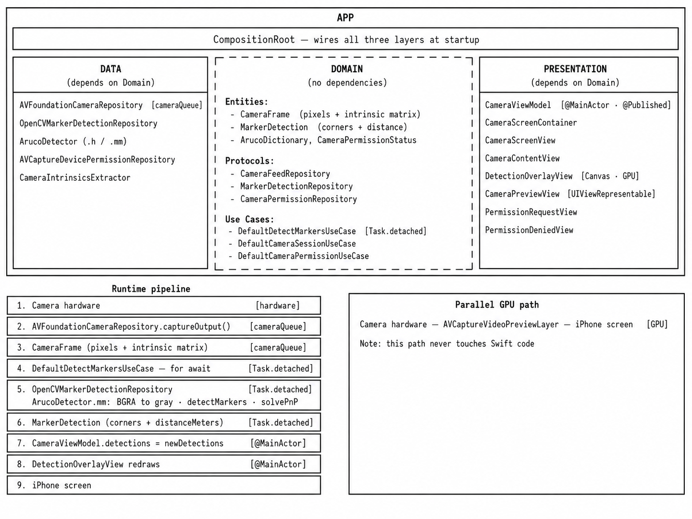
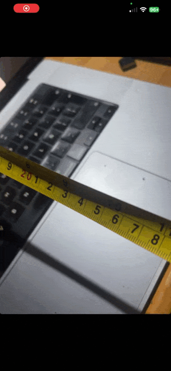
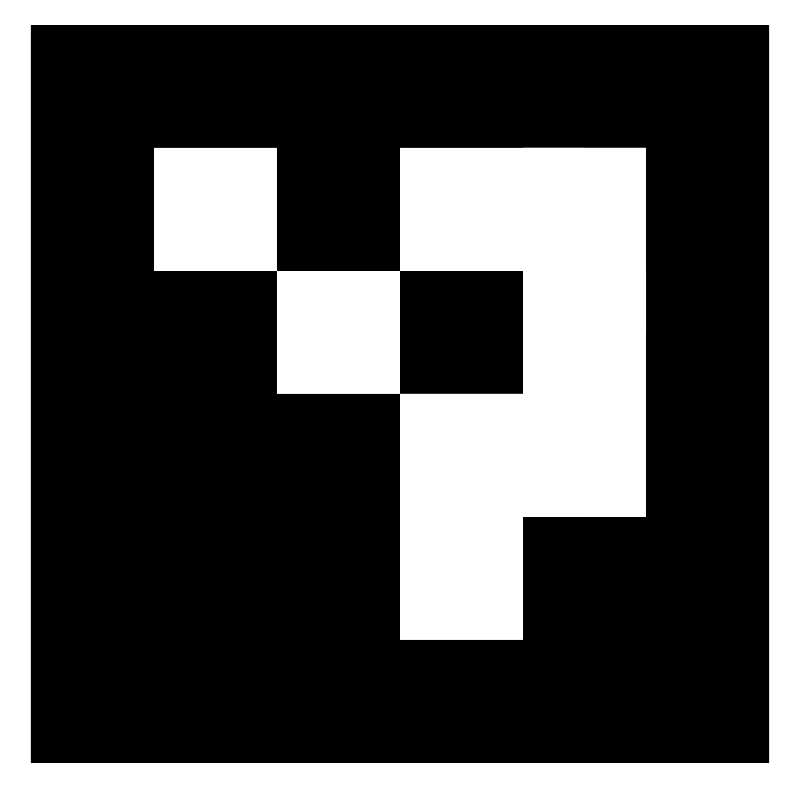

# ArucoDistance

Point your iPhone's back camera at a printed ArUco marker and the app shows you the distance in centimeters, live, as you move. A green contour traces the marker outline. No button to press, no internet, no setup beyond printing the marker.

Stack: **Swift 6 · AVFoundation · OpenCV 4.10 · SwiftUI**

<table>
  <tr>
    <td width="60%" valign="top">
      
    </td>
    <td width="40%" valign="top">
         
    </td>
  </tr>
</table>

---

## Why iOS over Android

The main reason is a single line of AVFoundation:

```swift
connection.isCameraIntrinsicMatrixDeliveryEnabled = true
```

iOS delivers the real, per-unit, factory-calibrated intrinsic matrix on every frame. Android has no equivalent — you either calibrate manually (chessboard, fifteen frames, `calibrateCamera`) or approximate from the declared FOV, which typically adds 5–15% of systematic error. That alone settles the platform question.

The rest are secondary benefits:

| Factor | iOS |
|---|---|
| Camera access | AVFoundation gives zero-copy `CVPixelBuffer` in BGRA32 — one memcpy-free path to `cv::Mat` |
| Concurrency | Swift 6 actor isolation makes concurrent code correct by construction, not by discipline |
| Toolchain | Profiler, debugger, and SwiftUI previews in one place |

---

## What it does

1. Opens the back camera at **720p portrait**, with factory intrinsics enabled.
2. Detects ArUco markers (dictionary `DICT_4X4_50`) on every frame using OpenCV 4.10's `ArucoDetector`.
3. Draws a **green contour** (`#00FF6A`, 4 pt) around each detected marker using a SwiftUI `Canvas`.
4. Computes distance with `cv::solvePnP` (method `SOLVEPNP_IPPE_SQUARE`) and shows it in cm, live.

The displayed number is ‖tvec‖ — the Euclidean norm of the translation vector from `solvePnP`. It's the distance from the camera lens to the center of the marker along the optical axis.

---

## Marker

<p align="center">
  
</p>

<p align="center"><strong>DICT_4×4_50 · ID 0</strong></p>

The printable PDF is at `aruco-distance-marker/marker/aruco-id0-4x4-50mm.pdf`.

**Print it at 10 × 10 cm.** In the print dialog, select "Actual size" or "100%" — never "Fit to page". After printing, verify with a ruler: the outer black square should be exactly 10 cm side to side.

If your printer scaled it, measure what you got and update one constant:

```swift
// Domain/ArucoConfig.swift
static let markerSideMeters: Double = 0.10  // update to match your ruler measurement
```

Full printing and detection guide: [`docs/marker-guide.md`](docs/marker-guide.md).

### Why 4×4 and why 10 cm

`DICT_4X4_50` decodes reliably at ~20 px per cell. At 6×6 that threshold rises to ~30 px/cell, cutting the usable range by ~30%. 50 IDs is overkill for a single-marker use case, but decoding performance is what matters here.

10 cm works well at everyday distances: at 100 cm the marker projects to ~100 px on 720p (above the decoding floor), at 30 cm it's ~340 px. Beyond 150 cm detection becomes unreliable — print bigger or get closer.

---

## Requirements

| | |
|---|---|
| macOS | Sequoia or newer |
| Xcode | 16.0 or newer (Swift 6.0 toolchain) |
| Device | iPhone with iOS 15+, back wide-angle camera |
| Simulator | Compiles but detects nothing |

---

## Build & Run

### 1. Clone

```bash
git clone <repo-url>
cd aruco-distance-marker-app
```

### 2. Add opencv2.framework

The framework (~534 MB) is not in the repo. Download **OpenCV 4.10.0 for iOS** from [opencv.org/releases](https://opencv.org/releases/) and place it at:

```
aruco-distance-marker-app/Frameworks/opencv2.framework
```

**Watch out:** the official download ships as a macOS-style versioned bundle with a `Versions/` tree and symlinks. iOS requires a flat bundle — no `Versions/`, everything at the root. If you skip this step, the installer fails with "too many levels of symbolic links". To flatten it:

```bash
cd Frameworks/opencv2.framework

# Move real files out of Versions/A/
rm opencv2 && mv Versions/A/opencv2 ./opencv2
rm Headers && mv Versions/A/Headers ./Headers
rm Modules && mv Versions/A/Modules ./Modules
rm Resources

# Copy Info.plist to root, then add CFBundleExecutable to it
cp Versions/A/Resources/Info.plist ./Info.plist
# Open Info.plist and add:
#   <key>CFBundleExecutable</key><string>opencv2</string>

rm -rf Versions
```

### 3. Open and run

```bash
open aruco-distance-marker/aruco-distance-marker.xcodeproj
```

Select your iPhone as destination, set your team under Signing & Capabilities, press ⌘R.

First install on device: **Settings → General → VPN & Device Management → trust your developer certificate**.

### 4. Check the marker size

Open `aruco-distance-marker/Domain/ArucoConfig.swift`. If your printed marker is exactly 10 cm, nothing to change. If not:

```swift
static let markerSideMeters: Double = 0.10  // set to your actual measurement in meters
```

No ruler handy? Hold the marker at a known distance (say 30 cm), note what the app reports, and apply:

```
corrected = current × (actual_cm / reported_cm)
```

---

## Architecture

Clean Architecture: three isolated layers and one composition root.

```
App           → @main entry + CompositionRoot (wires everything)
Presentation  → MVVM: CameraViewModel (@MainActor) + pure SwiftUI views
Domain        → Entities, protocols, use cases. Pure Swift, zero framework imports.
Data          → AVFoundationCameraRepository, OpenCVMarkerDetectionRepository
```

Dependency direction: `Presentation → Domain ← Data`. App is the only layer aware of all three. Domain imports nothing from Apple's camera or UI stacks — it could compile on Linux.

**Threading:** AVFoundation fires frames on `cameraQueue` (serial, `.userInteractive`). Detection runs in `Task.detached` on the cooperative thread pool. `@MainActor` handles only `@Published` assignments and SwiftUI rendering. `alwaysDiscardsLateVideoFrames = true` combined with `bufferingPolicy: .bufferingNewest(1)` means the pipeline drops frames automatically instead of building a queue.

Full file-by-file reference: [`docs/components.md`](docs/components.md).

---

## Known issues

| Issue | Effect | What it would take to fix |
|---|---|---|
| No temporal smoothing | Distance flickers ±1–2 cm | EMA: `d = 0.8×prev + 0.2×raw` |
| OIS jitter | ~1–3% variability | Disable OIS (preview quality drops) |
| Radial distortion not compensated | Error near frame edges | Chessboard calibration → pass dist coefficients to `solvePnP` |
| Portrait only | Can't use landscape | Remap image→view coordinate transform for 90° rotation |
| Single marker output | Reports only the first | Change `MarkerDetection` to array, sort by distance |

---

## References

- OpenCV ArUco tutorial: https://docs.opencv.org/4.x/d5/dae/tutorial_aruco_detection.html
- Online marker generator: https://chev.me/arucogen
- OpenCV for iOS: https://opencv.org/releases/
- iOS camera intrinsics: Apple WWDC 2017 "Advances in AVFoundation"

## License

MIT
